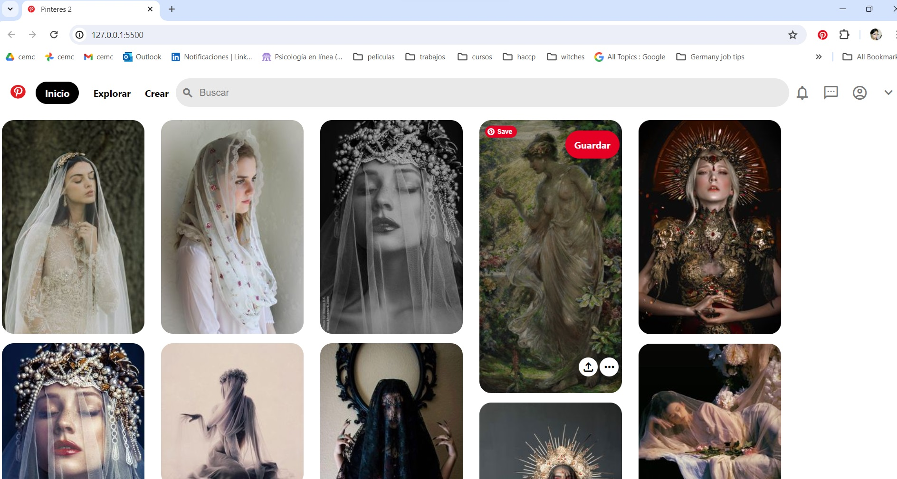

# Clon de Pinterest con HTML y CSS
Este proyecto es un clon de la interfaz de usuario de Pinterest, creado puramente con HTML y CSS3.

Se enfoca en replicar la apariencia visual de Pinteret, ofreciendo una experiencia de navegación similar con un diseño responsible y funcionalidades básicas.

### Características

* **Diseño Responsive:** Adaptable a diferentes tamaños de pantalla para una experiencia de usuario óptima en dispositivos móviles y de escritorio.

* **Interfaz de Usuario Intuitiva:** Inspirada en Pinterest, con una navegación fácil y accesible.

* **Interacciones Dinámicas:** Efectos visuales para elementos interactivos como botones y enlaces.

* **Iconografía y Estilos Modernos:** Uso de la biblioteca de iconos de Material Design y estilos CSS modernos y con apariencia innovadora

* ### Tecnologías Utilizadas
+ **HTML5:** Para la estructura básica del sitio.
+ **CSS3:** Para el diseño y el estilo, incluyendo _flexbox_ para un diseño responsivo y efectos de _hover_.
+ **Google Fonts:** Para fuentes personalizadas.

### Vista Previa del Proyecto

### Contacto
Si te gustaría invitarme a colaborar en un proyecto, escríbeme por [LinkedIn](https://www.linkedin.com/in/cemtzc/)
